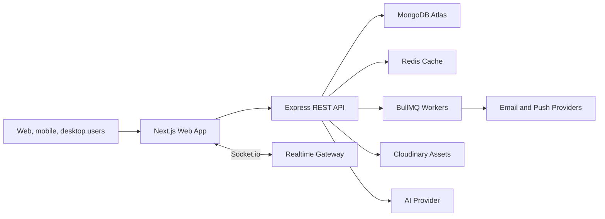

# FlowForge Architecture

FlowForge is organized as a deployable monorepo with clear frontend/backend boundaries and shared production conventions.

## System Shape



## Frontend

- Next.js App Router with route groups for marketing, auth, onboarding, and product app surfaces.
- Tailwind CSS 4 design tokens for dark/light themes, premium glass panels, readable gradients, responsive layouts, and motion-safe behavior.
- React Three Fiber powers the live animated wallpaper and cinematic landing surface.
- Framer Motion handles page transitions, hover depth, timer motion, onboarding, and board details.
- Zustand stores board state, timer state, command palette state, and persistent preferences.
- TanStack Query is configured as the async server-state layer.
- Socket.io Client connects workspace rooms for presence, typing, task updates, and notifications.
- shadcn-style components live in `apps/web/src/components/ui`.

## Backend

- Express 5 REST API with feature-based route modules.
- Mongoose schemas are indexed for workspace scoping, task search, board status queries, notification reads, analytics series, and focus history.
- JWT access and refresh tokens use secure HTTP-only cookies and device tracking.
- Security middleware includes Helmet, CORS, rate limiting, request logging, compression, HPP protection, Mongo sanitization, and Zod validation.
- Redis handles search cache and BullMQ connections.
- BullMQ queues support deadline reminders and analytics rollups.
- Socket.io rooms are scoped by workspace for realtime collaboration events.
- Cloudinary supports signed uploads and server-side upload fallback.

## Folder Structure

```text
apps/web/src
  app/                 App Router pages and route layouts
  components/          UI primitives and product modules
  hooks/               Socket and browser hooks
  lib/                 API client, mock data, shared frontend types
  store/               Zustand stores

apps/api/src
  config/              env, database, Redis, queues, Cloudinary, logger
  middleware/          auth, validation, security, errors
  models/              Mongoose schemas and indexes
  routes/              REST feature modules
  utils/               tokens, async handler, app errors
```

## Scaling Plan

- Add package-level shared DTOs under `packages/shared` when API contracts stabilize.
- Move AI provider calls behind `apps/api/src/services/ai.service.ts`.
- Add event-sourcing for audit-grade task timelines if enterprise compliance becomes a first-class SKU.
- Add virtualized Kanban lists for boards above 500 cards per column.
- Add OpenTelemetry traces across Next, API, Redis, MongoDB, and queues.
