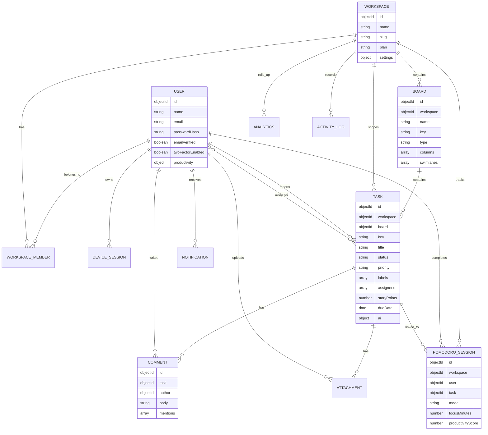

# ER Diagram

```mermaid
erDiagram
  USER ||--o{ WORKSPACE_MEMBER : belongs_to
  WORKSPACE ||--o{ WORKSPACE_MEMBER : has
  USER ||--o{ DEVICE_SESSION : owns
  WORKSPACE ||--o{ BOARD : contains
  BOARD ||--o{ TASK : contains
  WORKSPACE ||--o{ TASK : scopes
  USER ||--o{ TASK : reports
  USER }o--o{ TASK : assigned
  TASK ||--o{ COMMENT : has
  USER ||--o{ COMMENT : writes
  TASK ||--o{ ATTACHMENT : has
  USER ||--o{ ATTACHMENT : uploads
  USER ||--o{ NOTIFICATION : receives
  WORKSPACE ||--o{ POMODORO_SESSION : tracks
  USER ||--o{ POMODORO_SESSION : completes
  TASK ||--o{ POMODORO_SESSION : linked_to
  WORKSPACE ||--o{ ANALYTICS : rolls_up
  WORKSPACE ||--o{ ACTIVITY_LOG : records

  USER {
    objectId id
    string name
    string email
    string passwordHash
    boolean emailVerified
    boolean twoFactorEnabled
    object productivity
  }

  WORKSPACE {
    objectId id
    string name
    string slug
    string plan
    object settings
  }

  BOARD {
    objectId id
    objectId workspace
    string name
    string key
    string type
    array columns
    array swimlanes
  }

  TASK {
    objectId id
    objectId workspace
    objectId board
    string key
    string title
    string status
    string priority
    array labels
    array assignees
    number storyPoints
    date dueDate
    object ai
  }

  COMMENT {
    objectId id
    objectId task
    objectId author
    string body
    array mentions
  }

  POMODORO_SESSION {
    objectId id
    objectId workspace
    objectId user
    objectId task
    string mode
    number focusMinutes
    number productivityScore
  }
```
